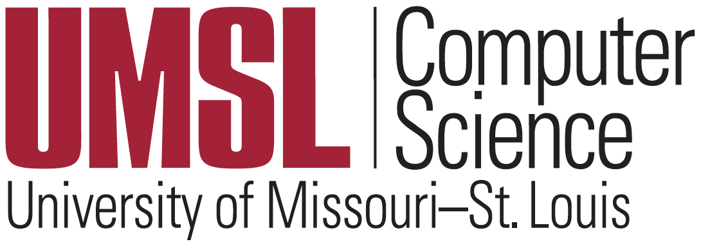
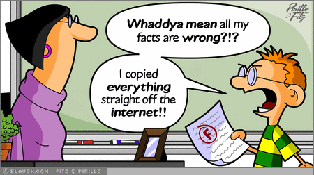

# Syllabus of Artificial Intelligence (CS 4300/5300)

- [Foo](#foo)
  - [Bar](#bar)
  - [Foobar](#foobar)
- [Barfoo](#barfoo)
  - [Barbar](#barbar)

## Instructor & contact information

- Instructor (Facilitator): [Badri Adhikari](http://umsl.edu/~adhikarib/){:target="_blank"} 
- Email: adhikarib@umsl.edu
- Class meets: Mo/We 6:55 to 8:10 PM; Mo at SSB 410 and We online synchronously via Zoom (see Canvas for the link)
- Office hours: Mondays 4:55 PM to 6:55 PM (please email to inform)

**Teaching philosophy:** Computer science and technology is mostly a practical discipline. To learn the fundamentals, an effective strategy is to follow an iterative process of <em>reading, analyzing, and coding</em>. However, many students either like to <em>analyze</em> or <em>code</em> but not both. While some of us enjoy developing the skills for critically assessing the concepts and algorithms, many others enjoy programming and love building things. I think that an effective computer science course should be a balance of (a) theoretical knowledge to understand how computer technology works, and (b) implementation skills to test and execute the theories and algorithms. I design course contents and assignments so that students have an opportunity to improve both: analytical and programming skills. Students with a rich programming experience may find this balance slightly easier but will have a platform to explore further. For many others who do not consider themselves expert programmers, taking such a course will be a rewarding experience.

## Course description in UMSL catalog

This course provides an introduction to artificial intelligence (AI). The list of topics may include artificial neural networks, search, planning, knowledge-based reasoning, probabilistic inference, machine learning, natural language processing, and practical applications. \[3 credit units\].

## Prerequisites  

CMPSCI 3130 (Design and Analysis of Algorithms) or Graduate Standing in CS.

## Learning outcomes  

This course consists of (a) the book's chapter topics in the form of recorded lectures (see lectures tab) along with corresponding homeworks, (b) a collection of activities as a crash course on 'machine learning using Keras/Tensorflow' (see nn-tf tab), and (c) a semester-long project (see project tab) on feed-forward neural networks. If you are new to artificial intelligence, Python, and machine learning, the activities and the project will require some exploration and study. But they provide you opportunities to learn the fundamentals of neural networks and the state-of-the art libraries to build prediction systems. Below are the learning outcomes:
* Use Python, Numpy and Keras to design, train, and evaluate basic feed-forward neural networks
* Learn artificial intelligence principles and approaches
* Learn a basic understanding of the building blocks of AI as presented in terms of intelligent agents
* Evaluate various searching algorithms
* Understand problems and ideas in the field of natural language processing, perception, and robotics
* Learn the philosophical foundations of AI and the future of AI
* Implement various AI algorithms such as depth-first search, and breadth-first search.

## Textbook  

Artificial Intelligence: A Modern Approach (3rd Edition) by [Pearson](https://www.pearson.com/us/higher-education/product/Russell-Artificial-Intelligence-A-Modern-Approach-3rd-Edition/9780136042594.html).

## Course topics

- **Book chapters**  
  - Chapter 18 - Learning From Examples
  - Chapter 1 - Introduction 
  - Chapter 2 - Intelligent Agents
  - Chapter 3 - Solving Problems by Searching 
  - Chapter 5 - Adversarial Search
  - Chapter 7 - Logical Agents
  - Chapter 22 - Natural Language Processing
  - Chapter 24 - Perception 
  - Chapter 25 - Robotics
  - Chapter 26 - Philosophy, Ethics, and Safety of AI

- **Machine learning using Tensorflow**   
  - Basics of Python, Numpy and Keras
  - Design, train, and evaluate basic feed-forward neural networks
  - Study feature importance and feature reduction

## Academic honesty

Any form of academic dishonesty in this class will result in an F for the semester and the case will be referred to the provost's office for possible further disciplinary action, regardless of how trivial it is. Please don't use another student's assignment (or a solution in the internet) to complete your own assignment. Discussing the material is 'OK', but please do your work on your own. You should complete the homework alone, not together, and not in a group. If you have any questions about any of the lessons or the assignments, please contact me, and I will point you in the right direction. Please read [UMSL's policy](https://www.umsl.edu/services/academic/policy/academic-dishonesty.html) and keep yourself out of plagiarism. Also, please remember that our `turnitin` tool also automatically checks for plagiarism.

    

## Programming language

Python3 is language for the course; you are expected to use Python3 for all of your classroom activities, homeworks, and project. You are welcome to use [Google colab](https://colab.research.google.com) or your own hosted Jupyter Notebook for running your programs.

## Due dates and late policy  

* Homeworks and project phases have their respective due dates (see Schedule).
* You can request a maximum two-day extension on any homeworks or project submissions - for up to two submissions. 
* If you email me a few hours before a deadline and I don't reply you immediately, and if you have not used your two-day extensions, you can assume that the extension is granted automatically.
* Once you use your extension days, late submissions will get no points.

## Homeworks

There will be three types of homeworks: project homeworks (see project tab), drawing concept maps as chapter summaries (see concept-map tab), and some chapters have additional homeworks (see homeworks tab). All homeworks should be submitted via Canvas. Concept maps should be submitted to the respective discussion boards so they are visible to other students in the class. You can view the concept maps uploaded by other students in the class only after you have submitted yours.

## Quizzes

Along with concept map homeworks, after watching the lectures in a chapter, you will need to take a five minute quiz. The questions on the quiz will be multiple-choice or true/false type. Please take this quiz right after watching the chapter lectures. Also, before taking the first quiz, please read the instructions on proctoring (see proctoring tab).

## In-person tests

There will be two in-person tests in this course (mid-term and final). Questions in the test will be similar to the homework questions.

## Grade composition  

| Submission | Total Points |
| :--- | ---: |
| Chapter concept maps | 10 |
| Chapter homeworks | 10 |
| Chapter quizzes | 20 |
| Chapter tests (mid-term + final) | 10 + 10 | 
| Semester-long project | 40 |

Note: You should submit the course evaluation survey at the end of the semester to receive your final grade.

## Grading scheme  

| Points (%)  | Grade |
| :----------- | :----- |
| 94 to 100 | A     |
| 90 to 94 | A-    |
| 87 to 90 | B+    |
| 84 to 87 | B     |
| 80 to 84 | B-    |
| 77 to 80 | C+    |
| 74 to 77 | C     |
| 70 to 74 | C-    |
| 67 to 70 | D+    |
| 64 to 67 | D     |
| 61 to 64 | D-    |
| 0 to 61  | F     |

 

## Resources

Your success in this class is important to me. If you need official accommodations, you have a right to have these met. If there are aspects of this course that prevent you from learning or exclude you, please let me know as soon as possible. Together we’ll develop strategies to meet both your needs and the requirements of the course. I encourage you to visit the following links to determine how you could improve your learning as well. 

* [Resources & Support](https://umsl.instructure.com/courses/44471/pages/student-resources-and-supports?module_item_id=454221)
* [Technology Assistance](https://umsl.instructure.com/courses/44471/pages/technology-assistance?module_item_id=454223)

## What students say

> "Sorry to bother you after the course is done. Thank you for your teaching and hard work for this semester. I enjoy your teaching in this course, and I learned a lot through this course. When starting this course, I have no experience with python and TensorFlow, but I can build my neural network right now. This gives me a ton of experience in AI and data science which I believe is very useful for my career. Also, through this course, I can feel the charm of AI. I get attracted to it, and I want to learn more about it when I am going to graduate school." - A student in fall 2021 class (online).

> "The hands-on approach of the activities and the course project were the best part of the course. These activities permitted us to delve as deep as we want in understanding the concepts. The course project allows us to use all the ideas learned from the activities and apply them to a problem of our choosing." - A student in fall 2020 class (on-line).

> "This course is like no other in the computer science department. Professor Badri went above and beyond to help us achieve the skills we will use in our work life after university. Many professors keep teaching the same theory stuff again and again and after the semester its impossible to recall what we studied but for this course we did a lot of programming and that we will remember and use in our actual life. I loved this class and other classes taught in this way." - A student in spring 2020 class (online).

> "I loved this course. Separating theory and programming was an excellent idea. I wish it was done for all courses." - A student in spring 2020 class (in-person).

> "I particularly liked all of these resources he provided to help us learn and guide us through the course." - A student in fall 2019 class (in-person).

> "I had not done Python programming before so I was bit lost at the beginning but the activity video lectures and sample Python notebooks helped me excel in the course. Being able to see the project report done by other students who had taken the course last semester was nice." - A student in fall 2019 class (in-person).

